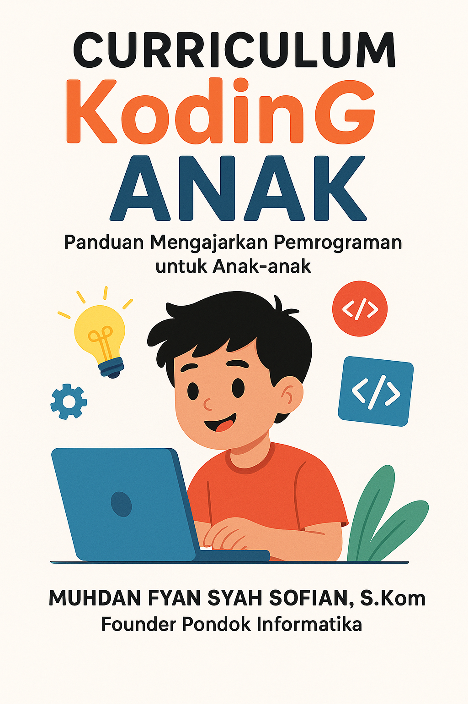

  

<h1 align="center">Panduan Mengajarkan Pemrograman untuk Anak & Remaja</h1>

Selamat datang di pusat sumber daya kurikulum coding! Repositori ini adalah panduan lengkap untuk para pengajar, orang tua, dan mentor dalam memilih dan menerapkan platform pembelajaran yang paling sesuai untuk siswa dari tingkat SD, SMP, hingga SMA.

---

### ✍️ **Disusun Oleh**

Kurikulum dan panduan ini dikurasi oleh:
**Muhdan Fyan Syah Sofian, S.Kom**

Dengan pengalaman lebih dari 10 tahun yang memadukan pendidikan Al-Quran dan pendidikan teknologi informasi, beliau berupaya menyusun kurikulum yang tidak hanya relevan secara teknis, tetapi juga memperhatikan aspek perkembangan psikologis dan nilai.

- **Pendidikan**:
  - S1 Teknik Informatika, Universitas Diponegoro
  - S2 Psikologi Islam (mahasiswa), International Open University (IOU)
- **Jabatan**:
  - Founder & Pimpinan Pondok Informatika
- **Website**:
  - [pondokinformatika.id](https://pondokinformatika.id)

*(Yayasan Pendidikan Pondok Informatika)*

---

## 🚀 Memulai: Empat Pilar Pembelajaran

Repositori ini dibangun di atas empat pilar utama untuk memberikan panduan yang komprehensif.

| Pilar | Deskripsi | Link Cepat |
| :--- | :--- | :--- |
| 📚 **Pustaka Referensi** | Pelajari teori dan karya fundamental yang menjadi dasar metodologi pengajaran coding modern. | [Lihat Pustaka Referensi](#-indeks-pustaka-referensi) |
| 🧠 **Metodologi** | Pahami "cara" mengajarkan coding secara efektif. Pelajari berbagai pendekatan pedagogis sebelum memilih alat. | [Lihat Metodologi](#-indeks-panduan-metodologi-pembelajaran) |
| 📘 **Kurikulum Code.org** | Jelajahi kurikulum terstruktur dan berjenjang dari Code.org, salah satu platform pendidikan CS terpopuler. | [Lihat Kurikulum Code.org](#-indeks-panduan-kurikulum-codeorg) |
| 🌐 **Platform Alternatif** | Temukan berbagai platform coding populer lainnya, masing-masing dengan kekuatan dan fokusnya sendiri. | [Lihat Platform Lainnya](#-indeks-panduan-platform-coding-populer-lainnya) |

---

## 📚 Indeks Pustaka Referensi

Bagian ini berisi ringkasan dan link ke beberapa karya paling berpengaruh dalam pendidikan teknologi dan komputasi. Untuk daftar lengkap yang terformat, silakan lihat file **Daftar Pustaka** kami.

- **[📜 Daftar Pustaka Lengkap](./referensi/DAFTAR_PUSTAKA.md)**

- **[📖 Lifelong Kindergarten oleh Mitchel Resnick](./referensi/resnick-lifelong-kindergarten.md)**
  - **Tentang**: Buku yang menjelaskan filosofi "4P" (Projects, Passion, Peers, Play) yang menjadi dasar platform Scratch.

- **[📖 Mindstorms oleh Seymour Papert](./referensi/papert-mindstorms.md)**
  - **Tentang**: Karya fundamental yang memperkenalkan ide Konstruksionisme, di mana anak belajar paling baik dengan membangun artefak yang dapat dibagikan.

- **[📖 Teori Game-Based Learning oleh James P. Gee](./referensi/gee-gbl.md)**
  - **Tentang**: Analisis mendalam tentang mengapa video game yang baik adalah lingkungan belajar yang sangat efektif.

---

## 🧠 Indeks Panduan: Metodologi Pembelajaran

Sebelum memilih alat, pahami pendekatannya. Bagian ini menjelaskan beberapa metodologi pengajaran yang paling efektif untuk coding.

- **[🎮 Game-Based Learning](./metodologi-pembelajaran/game-based-learning.md)**
  - **Penjelasan**: Menggunakan elemen game untuk memotivasi siswa dan memberikan konteks yang jelas untuk belajar coding.

- **[🏗️ Project-Based Learning (PjBL)](./metodologi-pembelajaran/project-based-learning.md)**
  - **Penjelasan**: Siswa belajar dengan mengerjakan proyek-proyek otentik yang bermakna, menjadikan proyek sebagai kendaraan belajar.

- **[🔎 Problem-Based Learning (PBL)](./metodologi-pembelajaran/problem-based-learning.md)**
  - **Penjelasan**: Berpusat pada proses pemecahan masalah yang kompleks dan terbuka, melatih pemikiran kritis dan kemandirian.

- **[🤝 Collaborative Learning](./metodologi-pembelajaran/collaborative-learning.md)**
  - **Penjelasan**: Mendorong siswa untuk bekerja sama, sebuah keterampilan kunci di dunia teknologi, termasuk teknik *Pair Programming*.

- **[🤔 Inquiry-Based Learning](./metodologi-pembelajaran/inquiry-based-learning.md)**
  - **Penjelasan**: Menempatkan rasa ingin tahu siswa sebagai pusat pembelajaran, mendorong mereka untuk bereksperimen dan menemukan solusi sendiri.

- **[🏆 Mastery-Based Learning](./metodologi-pembelajaran/mastery-based-learning.md)**
  - **Penjelasan**: Memastikan siswa benar-benar menguasai sebuah konsep sebelum melanjutkan ke konsep berikutnya, membangun fondasi yang kokoh.

---

## 📘 Indeks Panduan: Kurikulum Code.org

Kurikulum dari Code.org dirancang secara berjenjang untuk memandu siswa dari pengenalan pertama mereka hingga ke tingkat mahir yang setara dengan materi kuliah.

- **[🚀 Hour of Code](./roadmap-code-org/1_hour_of_code.md)**
  - **Penjelasan**: Panduan untuk menyelenggarakan kegiatan pengenalan coding selama satu jam yang seru dan dapat diakses oleh semua siswa, tanpa memerlukan pengalaman sebelumnya.

- **[🧩 CS Fundamentals](./roadmap-code-org/2_cs_fundamentals.md)**
  - **Penjelasan**: Kurikulum lengkap untuk siswa **Sekolah Dasar (SD)**, berfokus pada fondasi pemikiran komputasi melalui aktivitas online dan *unplugged*.

- **[🔍 CS Discoveries](./roadmap-code-org/3_cs_discoveries.md)**
  - **Penjelasan**: Kurikulum modular untuk siswa **Sekolah Menengah Pertama (SMP)**, memungkinkan eksplorasi kreatif di berbagai bidang seperti web, game, dan aplikasi.

- **[🧠 CS Principles](./roadmap-code-org/4_cs_principles.md)**
  - **Penjelasan**: Kursus mendalam setara AP (*Advanced Placement*) untuk siswa **Sekolah Menengah Atas (SMA)**, mencakup cara kerja internet, data, algoritma, dan dampak teknologi.

---

## 🌐 Indeks Panduan: Platform Coding Populer Lainnya

Berikut adalah panduan untuk berbagai platform alternatif, masing-masing menawarkan pendekatan unik untuk belajar coding.

| Platform | Target Usia | Fokus Utama | Link ke Panduan |
| :--- | :--- | :--- | :--- |
| 👶 **ScratchJr** | 5-7 thn (PAUD/TK) | Bercerita digital & logika dasar visual | [Lihat Panduan](./web-curicullum/scratch_jr/index.md) |
| 🐾 **Kodable** | 5-10 thn (SD) | Jalur belajar terstruktur dari blok ke JavaScript | [Lihat Panduan](./web-curicullum/kodable/index.md) |
| 🐱 **Scratch** | 8-16 thn (SD/SMP) | Kreativitas, game, animasi & komunitas global | [Lihat Panduan](./web-curicullum/scratch/index.md) |
| 🚀 **Tynker** | 5-14+ thn (SD/SMP) | Kurikulum terstruktur, modding Minecraft & robotika | [Lihat Panduan](./web-curicullum/tynker/index.md) |
| 🐒 **CodeMonkey** | 8-14 thn (SD/SMP) | Belajar kode teks (CoffeeScript & Python) melalui game | [Lihat Panduan](./web-curicullum/code_monkey/index.md) |
| 🧩 **Blockly Games** | 8-14 thn (SD/SMP) | Mengajarkan logika murni melalui serangkaian puzzle | [Lihat Panduan](./web-curicullum/blockly/index.md) |
| 🎓 **Khan Academy** | 12+ thn (SMP/SMA) | Pendekatan akademis untuk JS, HTML/CSS & SQL | [Lihat Panduan](./web-curicullum/khan_academy/index.md) |
| ⚔️ **CodeCombat** | 10+ thn (SMP/SMA) | Belajar Python/JS dengan bermain game petualangan (RPG) | [Lihat Panduan](./web-curicullum/code_combat/index.md) |
| 📱 **App Inventor** | 12+ thn (SMP/SMA) | Mendesain dan membangun aplikasi Android nyata | [Lihat Panduan](./web-curicullum/app_inventor/index.md) |
| 💡 **Lightbot** | 6+ thn (SD Awal) | Menguasai logika murni (prosedur & loop) dengan puzzle | [Lihat Panduan](./web-curicullum/lightbot/index.md) |
| 🚚 **Code for Life** | 8-14 thn (SD/SMP) | Transisi terpandu dari blok visual ke Python | [Lihat Panduan](./web-curicullum/code_for_life/index.md) |
| 🤖 **mBlock** | 8-18+ thn (SD-SMA) | Menghubungkan kode dengan robotika & AI | [Lihat Panduan](./web-curicullum/mblock/index.md) |

---

✨ Selamat mengajar dan menginspirasi generasi kreator berikutnya! ✨

